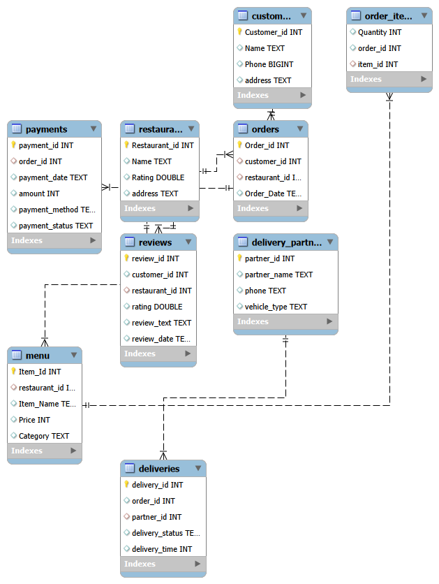

# 🍔 Food Delivery Analytics SQL Project

## 📌 Project Overview

This project analyzes a Food Delivery Platform using MySQL.

The objective is to generate business insights related to customer behavior, restaurant performance, revenue trends, delivery efficiency, and payment analysis.

The dataset contains 5,000+ orders generated using Python and stored in a relational MySQL database.

---

## 🛠️ Tools Used

- MySQL
- MySQL Workbench
- Python
- Pandas
- Faker
- GitHub

---

## 🗂️ Database Schema

The database consists of 9 interconnected tables:

- customers
- restaurant
- menu
- orders
- order_items
- payments
- deliveries
- reviews
- delivery_partner

### ER Diagram

---

## 📊 Dataset Summary

| Table | Records |
|---------|---------:|
| Customers | 500 |
| Restaurants | 30 |
| Menu Items | 300 |
| Orders | 5,000 |
| Order Items | 10,000+ |
| Payments | 5,000 |
| Reviews | 3,000 |
| Delivery Partners | 100 |
| Deliveries | 5,000 |

---

## 🔑 SQL Concepts Applied

### Joins
- INNER JOIN
- LEFT JOIN

### Aggregations
- SUM()
- AVG()
- COUNT()
- MAX()
- MIN()

### Subqueries
- Correlated Subqueries
- Nested Queries

### Common Table Expressions (CTEs)

### Window Functions
- ROW_NUMBER()
- RANK()
- DENSE_RANK()
- LAG()
- Running Totals

### Data Modeling
- Primary Keys
- Foreign Keys
- Entity Relationship Diagram (ERD)

---

## 📈 Business Questions Solved

### Customer Analysis
- Total Customers
- Repeat Customers
- Top Customers by Orders
- Customer Lifetime Value (CLV)

### Restaurant Analysis
- Top Revenue Generating Restaurants
- Highest Rated Restaurants
- Restaurant Revenue Contribution %

### Sales Analysis
- Monthly Revenue Trend
- Average Order Value
- Month-over-Month Revenue Growth

### Delivery Analysis
- Average Delivery Time
- Fastest Delivery Partners
- Delivery Status Analysis

### Payment Analysis
- Payment Method Distribution
- Failed Payment Analysis

### Review Analysis
- Restaurant Rating Analysis
- Customer Feedback Trends

---

## 📷 Sample Outputs

### Revenue Contribution by Restaurant

### Month-over-Month Revenue Growth using LAG()

### Top Customers Analysis

---

## 💡 Key Insights

- Identified the highest revenue-generating restaurants.
- Measured customer retention through repeat-order analysis.
- Calculated Month-over-Month revenue growth using LAG().
- Evaluated delivery performance across delivery partners.
- Analyzed customer spending behavior and lifetime value.
- Ranked restaurants based on revenue and ratings.

---

## 🚀 Project Outcome

This project demonstrates practical SQL skills used in real-world business environments, including data modeling, advanced querying, KPI analysis, and business intelligence reporting.

---

## 👤 Author

**Prachi Dakalia**

GitHub: 
